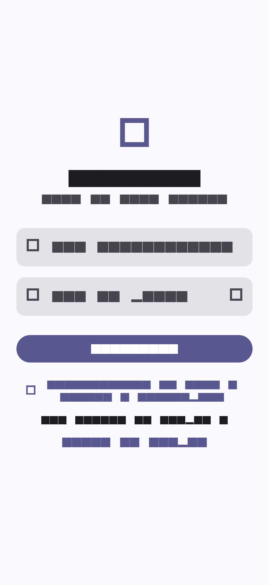
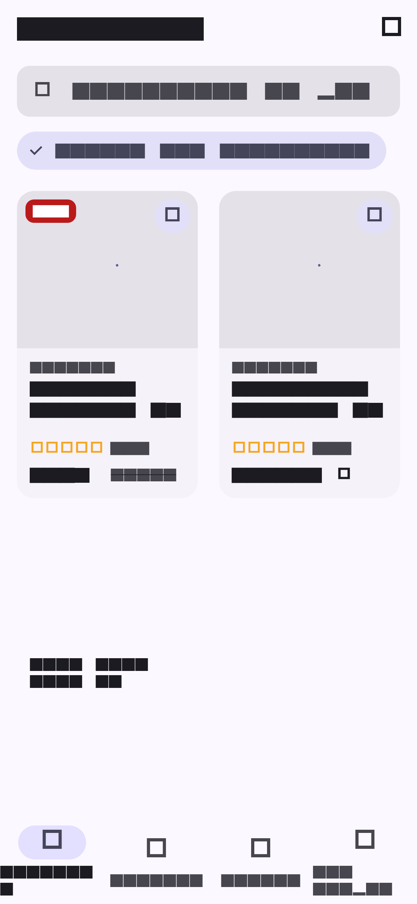
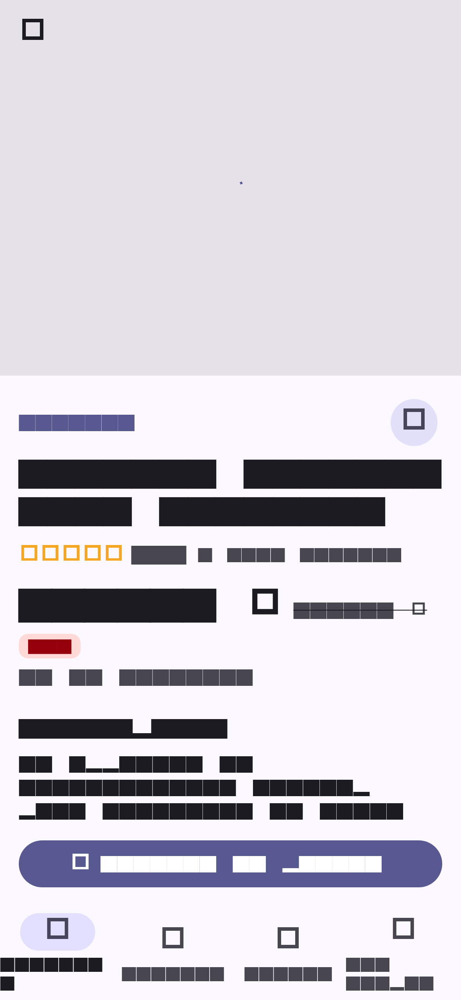
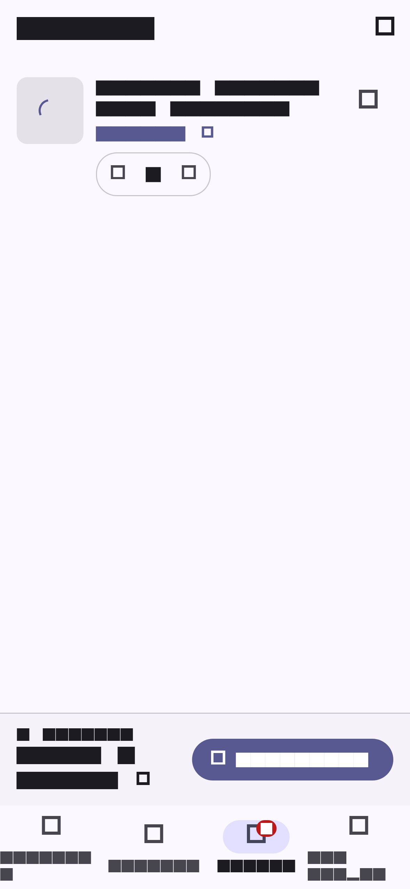
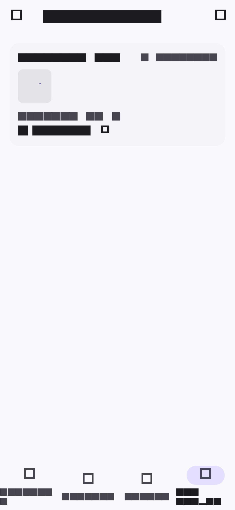
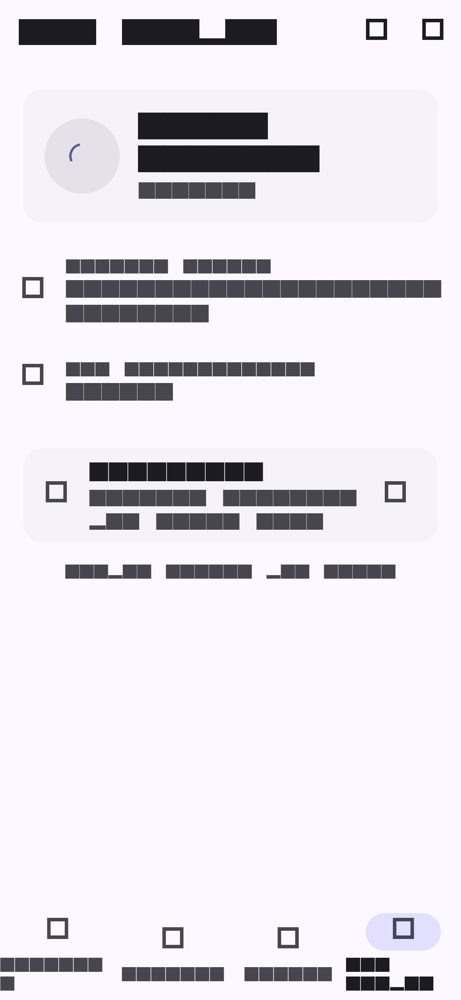

# She4Tech Boutique

Application e-commerce Flutter connectée à une vraie API REST ([DummyJSON](https://dummyjson.com)),
avec authentification JWT, cache hors-ligne et Clean Architecture.


---

## Captures d'écran

| Connexion | Catalogue | Fiche produit |
|:---------:|:---------:|:-------------:|
|  |  |  |

| Panier | Commandes | Compte |
|:-----:|:--------:|:------:|
|  |  |  |

> Les captures ne sont pas des images dessinées à la main : elles sont produites par
> `test/app/screenshots_test.dart`, qui rend les écrans réels de l'application
> (390 × 844 pt, densité 3) sur une API en mémoire. Régénération :
> `flutter test test/app/screenshots_test.dart --update-goldens`
> Les photos produits ne sont pas rechargées dans ce contexte hors-ligne : les
> zones d'image apparaissent donc dans leur état de substitution, ce que la suite
> de tests accepte volontairement.

---

## Fonctionnalités

- **Catalogue** — grille responsive (1 à 4 colonnes), recherche avec debounce,
  filtre par catégorie, tri (prix, note, nouveautés), pull-to-refresh
- **Fiche produit** — notation par étoiles, description, caractéristiques,
  informations de garantie/livraison/retour, avis clients, ajout au panier
- **Panier** — quantités, suppression, total recalculé, badge sur l'onglet,
  commande rattachée au compte
- **Favoris** — persistance locale, synchronisés avec le catalogue
- **Commandes** — historique par utilisateur, cache local, pull-to-refresh
- **Profil** — données de l'utilisateur, options, aide, à propos, déconnexion
- **Paramètres** — thème clair/sombre, langue FR/EN, notifications, confidentialité
- **Compte invité** — catalogue, favoris et panier accessibles sans connexion
- **Bilingue** — français et anglais, formatage monétaire localisé
- **Adaptatif** — `NavigationBar` sur mobile, `NavigationRail` sur grand écran
- **Hors-ligne** — chaque écran affiche ses données en cache et un bandeau
  « hors-ligne » ; les écritures locales (panier, favoris) restent possibles

## Comptes de démonstration

| Champ | Valeur |
|-------|--------|
| Identifiant | `emilys` |
| Mot de passe | `emilyspass` |

> L'inscription passe par `POST /users/add`, que DummyJSON ne permet pas
> d'authentifier ensuite. Les comptes créés dans l'application sont donc
> enregistrés localement et la connexion bascule sur eux uniquement après un refus
> explicite de l'API.

---

## Démarrage

```sh
flutter pub get
flutter run
```

Aucune clé d'API ni configuration n'est nécessaire : l'API publique est l'unique
dépendance externe.

### Plateformes

| Plateforme | Statut |
|------------|--------|
| Web        | ✅ `flutter build web --release` |
| Android    | ✅ |
| iOS        | ✅ |
| Linux      | ⚠️ nécessite `g++` sur la machine hôte |

---

## Architecture

Clean Architecture par fonctionnalité, un dossier `data` / `domain` /
`presentation` par cas d'usage :

```
lib/
├── main.dart
├── app/                     # Thème, routes, coquille des onglets
│   ├── router/app_router.dart
│   └── shell/app_shell.dart
├── core/                    # Socle transverse
│   ├── di/providers.dart            # Graphe Riverpod
│   ├── network/                     # Dio, intercepteur JWT, chemins d'API
│   ├── storage/                     # Hive, secure storage, store de jetons
│   ├── l10n/                        # Chaînes FR/EN
│   ├── error/error_mapper.dart      # DioException → exception métier
│   ├── theme/  widgets/  config/
└── features/
    ├── auth/      catalog/     cart/     favorites/
    └── orders/    profile/     settings/ help/ about/
```

- **Riverpod** pour l'état : providers asynchrones pour le catalogue, les
  commandes et la session, providers synchrones pour le panier et les favoris.
- **GoRouter** avec `StatefulShellRoute.indexedStack` : quatre onglets qui
  conservent leur propre pile de navigation, plus un garde de session.
- **Dio** avec un intercepteur qui rafraîchit le jeton d'accès sur `401` et
  rejoue la requête, en sérialisant les rafraîchissements concurrents.

### Persistance

| Donnée | Support | Raison |
|--------|---------|--------|
| Jetons JWT | `flutter_secure_storage` | Un secret ne doit jamais atterrir dans Hive |
| Catalogue, commandes, profil, panier, favoris, préférences | Hive (JSON, horodatés) | Lecture synchrone au démarrage, cache hors-ligne |
| Identifiants des comptes créés localement | Hash salé (SHA-256) | Éviter le mot de passe en clair |

Les écritures dans Hive sont toujours «lectures d'abord, puis remplacement
atomique », et le cache des commandes est cloisonné par utilisateur.

---

## API utilisée

Base : `https://dummyjson.com` — 8 points d'entrée, tous vérifiés en direct :

| Méthode | Chemin | Usage |
|---------|--------|-------|
| `POST` | `/auth/login` | Connexion, jetons d'accès et de rafraîchissement |
| `GET`  | `/products` | Catalogue paginé |
| `GET`  | `/products/search` | Recherche |
| `GET`  | `/products/category/{cat}` | Filtre par catégorie |
| `GET`  | `/products/{id}` | Fiche produit et avis |
| `GET`  | `/products/categories` | Liste des catégories |
| `GET`  | `/carts/user/{id}` | Panier distant |
| `GET`  | `/users/{id}` | Profil |

---

## Tests

```sh
flutter test
```

**76 tests, aucun accès réseau** : l'API est simulée par un adaptateur Dio en
mémoire (`test/support/`).

| Suite | Ce qu'elle protège |
|-------|--------------------|
| `test/features/auth/auth_repository_test.dart` (23) | Connexion API, repli local, expiration, rafraîchissement, déconnexion, persistance par origine |
| `test/features/catalog/catalog_repository_test.dart` (12) | Recherche, catégories, tri, cache, fichiers corrompus, erreurs réseau |
| `test/features/orders/orders_repository_test.dart` (6) | Cloisonnement par utilisateur, repli cache, effacement |
| `test/features/cart/cart_controller_test.dart` (10) | Quantités, totaux, persistance, entrées corrompues |
| `test/core/error_mapper_test.dart` (13) | Traduction des erreurs Dio en exceptions métier |
| `test/app/app_smoke_test.dart` (6) | Routeur, garde de session, connexion réelle, onglets, panier |
| `test/app/screenshots_test.dart` (6) | Non-régression de mise en page des écrans + captures |

Qualité :

```sh
flutter analyze     # aucun avertissement
dart format --set-exit-if-changed lib test
```

---

## Choix techniques notables

- **Un seul état pour l'UI** : les écrans lisent des providers ; aucun écran
  n'appelle `Dio` ni `Hive` directement.
- **Échec réseau jamais fatal** : chaque repository renvoie son cache et
  `ErrorMapper` transforme l'exception en message affichable.
- **Cache robuste** : une entrée illisible est ignorée au lieu de casser l'écran
  (cas couvert par les tests panier et commandes).
- **Bandeau hors-ligne tolérant** : l'absence de détecteur réseau sur une
  plateforme non supportée ne produit plus d'erreur non gérée.
- **Mises en page vérifiées sur téléphone** : les grilles, prix et en-têtes
  s'adaptent aux textes français les plus longs ; la suite de captures échoue
  si un écran déborde.

## Limites connues

- Le build Linux exige `g++` sur la machine hôte (le projet n'y peut rien).
- Les mots de passe des comptes locaux utilisent un hash salé SHA-256 ; un
  KDF dédié (`argon2`, `bcrypt`) serait préférable en production.
- Les captures d'écran n'affichent pas les photos produits : le gestionnaire
  d'images de `cached_network_image` revalide systématiquement par le réseau,
  ce qu'un test de widget ne peut pas attendre.
