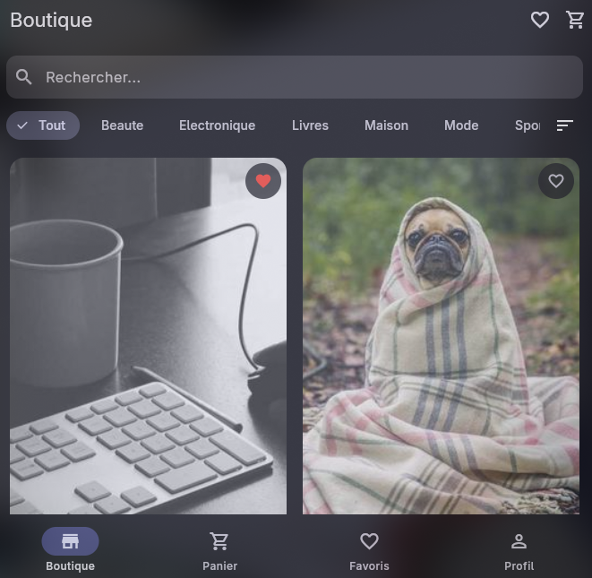
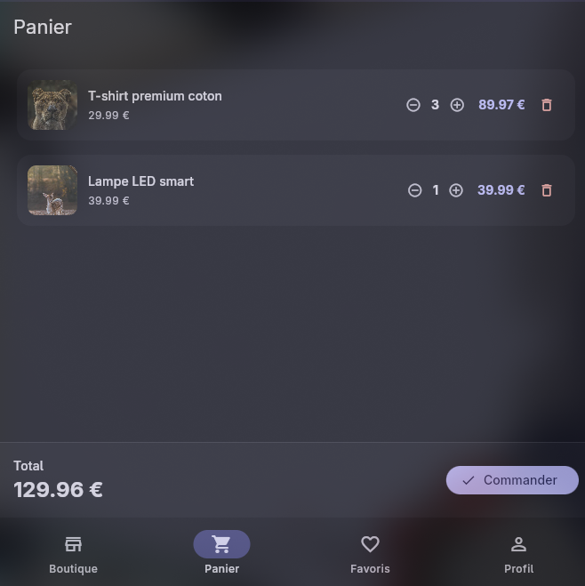
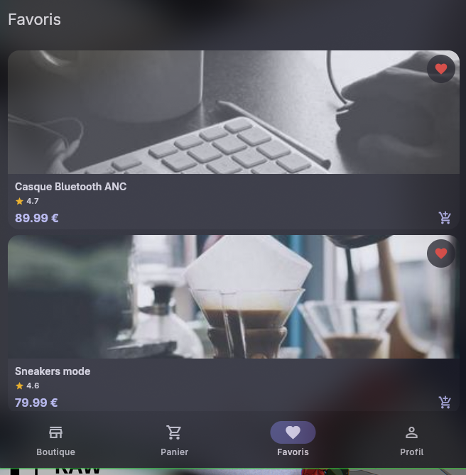
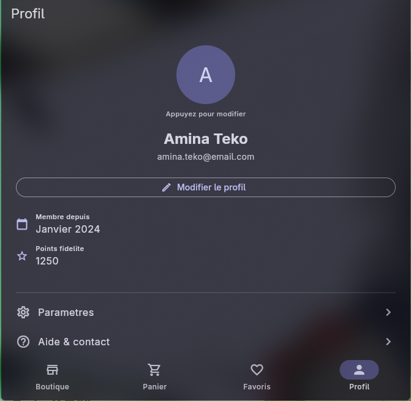
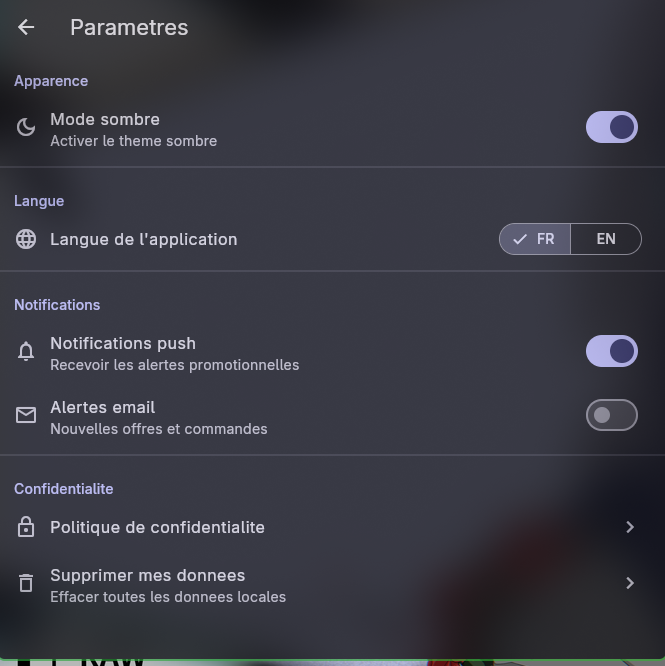

# She4Tech Boutique

Application e-commerce Flutter premium avec gestion d'etat **Riverpod**.
Catalogue, panier, favoris, notation, profil, parametres, aide — tout est la.


---

## Captures d'ecran

| Catalogue | Panier | Favoris | Profil | Parametres |
|:---------:|:------:|:-------:|:------:|:----------:|
|  |  |  |  |  |

---

## Fonctionnalites

- **Catalogue** — grille responsive, recherche, filtrage par categorie, tri (prix, note, recents)
- **Detail produit** — images reelles Lorem Picsum, notation etoiles 1-5, description, ajouter au panier
- **Panier** — modification de quantite, suppression, total dynamique, commande simulee
- **Favoris** — toggle persiste via SharedPreferences
- **Profil** — nom/email modifiables, avatar initiale, date d'adhesion, points fidelite
- **Parametres** — theme clair/sombre, langue FR/EN, notifications, confidentialite
- **Aide** — FAQ expandable + formulaire de contact avec validation
- **A propos** — informations app, technologies, licence
- **Navigation adaptive** — BottomNavigationBar (mobile) / NavigationRail (desktop)
- **Theme Material 3** — seed color `#1A1A2E`, clair + sombre
- **Internationalisation** — FR et EN interchangables en un clic

---

## Installation

### Pre-requis

- [Flutter SDK](https://docs.flutter.dev/get-started/install) >= 3.44.1
- Dart >= 3.12.1
- IDE : VS Code, Android Studio, ou IntelliJ
- Plateformes : Android, iOS, Linux, Web

### Cloner le depot

```bash
git clone https://github.com/esthera-tiago/E_Commerce.git
cd E_Commerce
```

### Installer les dependances

```bash
flutter pub get
```

### Lancer l'application

```bash
# Linux
flutter run -d linux

# Web
flutter run -d chrome

# Mobile (emulateur/simulateur conecte)
flutter run
```

### Tests

```bash
flutter test
```

### Build release

```bash
# Linux
flutter build linux

# Web
flutter build web

# Android APK
flutter build apk
```

---

## Dependances

| Package | Version | Role |
|---|---|---|
| `flutter_riverpod` | ^2.6.1 | Gestion d'etat |
| `go_router` | ^16.0.0 | Navigation declarative |
| `shared_preferences` | ^2.5.0 | Persistance locale |
| `cached_network_image` | ^3.4.1 | Chargement images reseau |
| `cupertino_icons` | ^1.0.8 | Icones iOS |

---

## Structure du projet

```
lib/
  main.dart                          # Entree, ProviderScope
  app.dart                           # MaterialApp.router + theme + locale
  router/
    app_router.dart                  # GoRouter — 8 routes
  theme/
    app_theme.dart                   # Material 3 light + dark
  l10n/
    app_localizations.dart           # Chaines FR/EN (80+)
  models/
    product.dart                     # Product (immutable, copyWith, fromJson)
    cart_item.dart                   # CartItem (Product + quantite)
    user.dart                        # User (profil mock)
    filter_state.dart                # FilterState + SortOption
  data/
    products.json                    # 20 produits reels (Lorem Picsum)
    product_repository.dart          # Chargement asset + cache memoire
  providers/
    product_provider.dart            # productList, categories, filter, filtered
    cart_provider.dart               # cart, cartTotal, cartItemCount
    favorites_provider.dart          # favoris persistes SharedPreferences
    user_provider.dart               # profil editable
    user_ratings_provider.dart       # notations persistees
  screens/
    home_screen.dart                 # Catalogue (grille, recherche, filtres)
    product_detail_screen.dart       # Detail + notation etoiles
    cart_screen.dart                 # Panier + commande
    favorites_screen.dart            # Favoris
    profile_screen.dart              # Profil + sous-ecrans
    settings_screen.dart             # Theme, langue, notifications
    help_screen.dart                 # FAQ + contact
    about_screen.dart                # A propos
  widgets/
    adaptive_scaffold.dart           # Responsive NavigationRail / BottomBar
    filter_bar.dart                  # Recherche + chips + tri
    product_card.dart                # Carte produit + favori + panier
    animated_cart_button.dart        # Animation scale
    cart_item_tile.dart              # Ligne panier +/- quantite
    rating_bar.dart                  # Barre etoiles interactive
    app_scope.dart                   # InheritedWidget theme + locale
```

---

## Providers (11)

| Provider | Type | Role |
|---|---|---|
| `productRepositoryProvider` | `Provider<ProductRepository>` | Singleton repository |
| `productListProvider` | `FutureProvider<List<Product>>` | Produits depuis JSON |
| `categoriesProvider` | `FutureProvider<List<String>>` | Categories dynamiques |
| `filterProvider` | `StateNotifierProvider<FilterNotifier, FilterState>` | Filtres + tri |
| `filteredProductsProvider` | `Provider<List<Product>>` | Produits filtres (derive) |
| `cartProvider` | `StateNotifierProvider<CartNotifier, List<CartItem>>` | Panier |
| `cartItemCountProvider` | `Provider<int>` | Nombre total d'articles |
| `cartTotalProvider` | `Provider<double>` | Montant total |
| `sharedPrefsProvider` | `FutureProvider<SharedPreferences>` | Persistance |
| `favoritesProvider` | `StateNotifierProvider<FavoritesNotifier, Set<String>>` | Favoris persistes |
| `userRatingsProvider` | `StateNotifierProvider<UserRatingsNotifier, Map<String, int>>` | Notation persistee |
| `editableUserProvider` | `StateNotifierProvider<EditableUserNotifier, User>` | Profil editable |

---

## Auteurs

**Esthera-Tiago** — [GitHub](https://github.com/esthera-tiago)

---

## Licence

MIT
